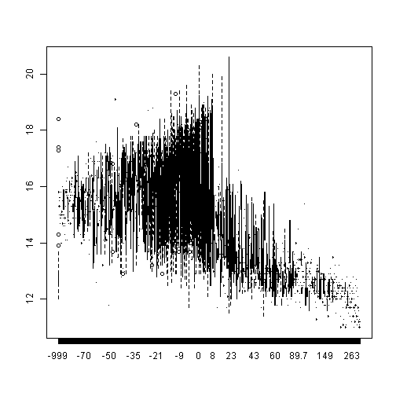
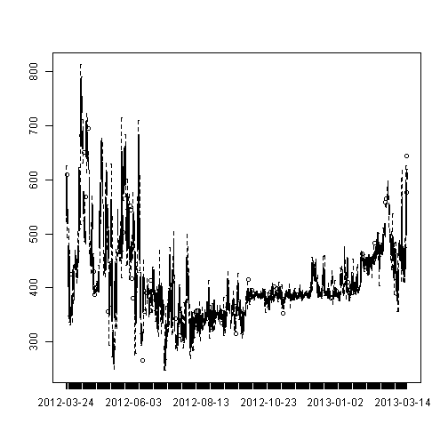

## Ocean Carbon Dioxide: Study Summary

An environmental of particular interested in is the health of the oceans and how pollution and carbon levels will impact it's species. 

Elizabeth Kolbert's book [The Sixth Extinction: An Unnatural History] (http://us.macmillan.com/thesixthextinction-1/elizabethkolbert) provides a well researched account of the impact of carbon to species with calcium based exoskeletons in Chapter 6, The Sea Around Us. 

Tasked with presenting a data product, I found public data availble from the [CDIAC: Carbon Dioxide Information Analysis Center}(http://cdiac.ornl.gov). I chose to use data collected from a single monitoring site to minimize the quatity of data for this presentation. 
 

An interactive tool is available to compare and contrast the data collected:

[Ocean Carbon Dioxide Measurements by Date](https://meganminshew.shinyapps.io/BDP_Project)

---

## Ocean Carbon Dioxide: The data collected

[Ocean Carbon Dioxide Measurements by Date](https://meganminshew.shinyapps.io/BDP_Project) provides the user with two lists of data elements that are combined into a box plot. Here is an example of Air Temperature (degrees celsius) compared with CO2 Levels in the ocean after atmospheric CO2 is removed.

 

---

## Ocean Carbon Dioxide: Special features

To better understand the change of a measure over time the application includes each of the chosen measures in its own time series box plot. You can monitor CO2 Levels over time with this functionality.

 

As the data is collected over multiple intervals during each day, the user has the option to take the daily average instead of each data point. 

To provide additional usefullness, the user may also remove outliers in the data.

---

## Ocean Carbon Dioxide: Source Citations

This project would not be possible without the contributions of:

Sutton, A., C. Sabine, S. Maenner, S. Musielewicz, R. Bott, and J. Osborne. 2013. 
High-resolution ocean and atmosphere pCO2 time-series measurements from 
mooring CCE2_121W_34N. http://cdiac.esd.ornl.gov/ftp/oceans/Moorings/CCE2_121W_34N/. 
Carbon Dioxide Information Analysis Center, Oak Ridge National Laboratory, US 
Department of Energy, Oak Ridge, Tennessee. doi: 10.3334/CDIAC/OTG.TSM_CCE2_121W_34N

The specific data in use in this study is publicly available and can be downloaded here: [CCE2_121W_34N_Mar2012_Mar2013.csv](http://cdiac.ornl.gov/ftp/oceans/Moorings/CCE2_121W_34N/CCE2_121W_34N_Mar2012_Mar2013.csv)
